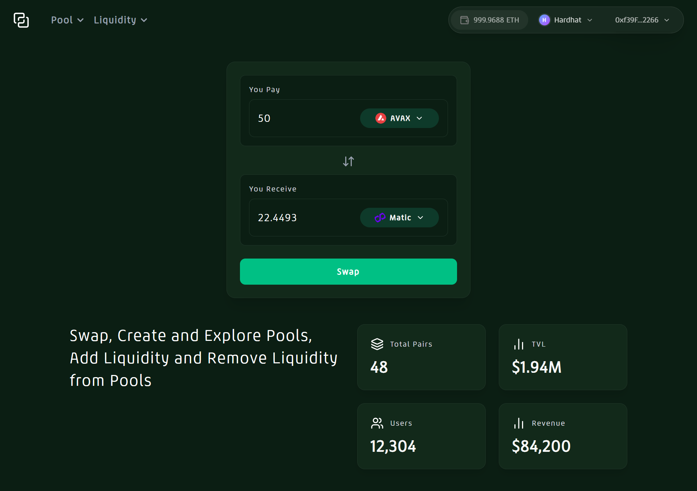
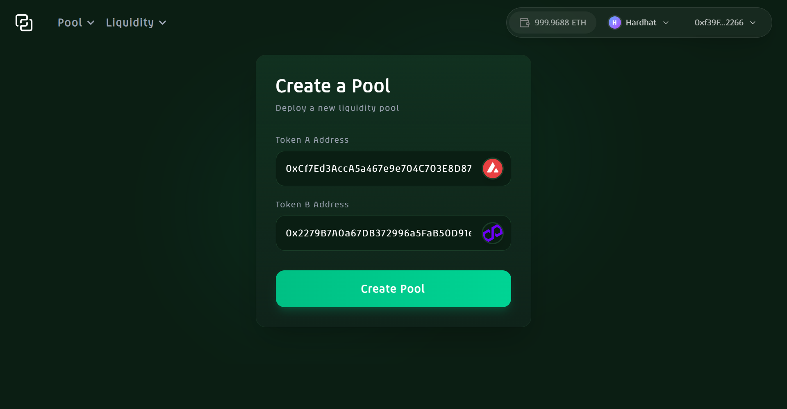
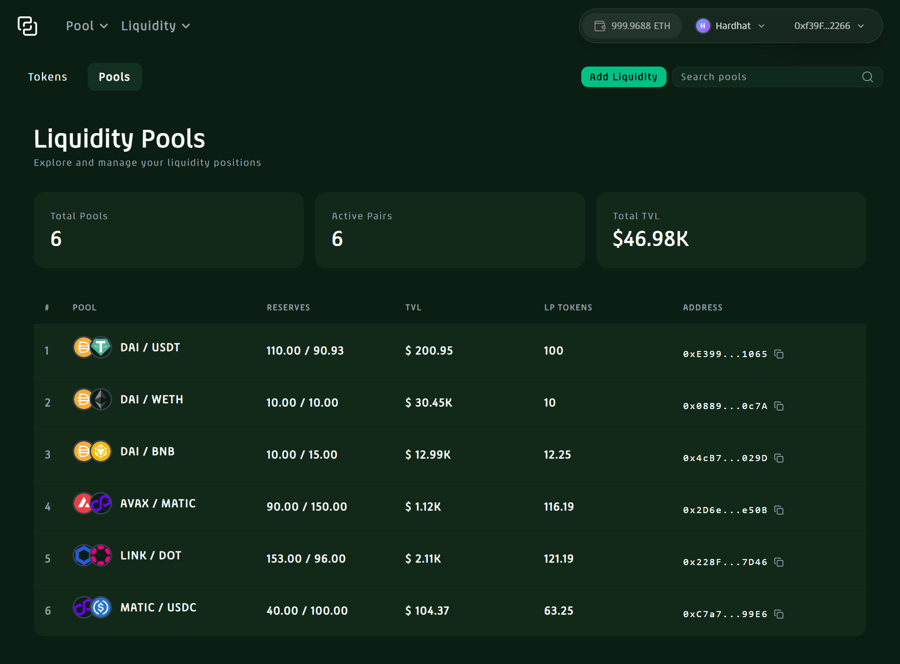
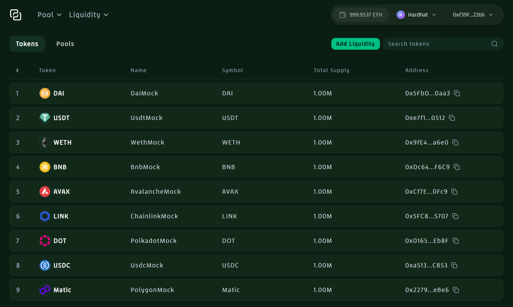
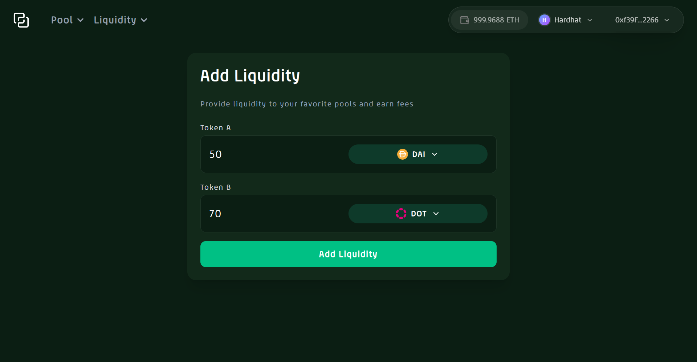

# DEX (Decentralized Exchange) — Uniswap V2 DApp


_Landing section showcasing the DApp._

This DEX is built using the **Uniswap V2 protocol**, allowing users to:

- Create token pairs (pools)
- Add and remove liquidity
- Explore pools and tokens
- Swap tokens

---

## Contracts

The smart contracts powering this DApp are **battle-tested** and include:

```
onchain-protocols/contracts
├─ interfaces
├─ libraries
├─ mocks
│  ├─ router
│  └─ tokens
├─ UniswapV2ERC20.sol
├─ UniswapV2Factory.sol
└─ UniswapV2Pair.sol
```

---

## Supported Chains

- Sepolia
- Arbitrum
- Arbitrum Sepolia
- Avalanche Fuji
- Optimism
- Optimism Sepolia
- zkSync

---

## Tech Stack

- **Frontend:** React (Vite ^7.1.2), Tailwind CSS, Shadcn/UI
- **Backend:** Node.js, MongoDB
- **Blockchain:** Ethers.js, Hardhat for deployment & testing
- **Wallet Integration:** Reown AppKit

---

## Features

### 1) Hero Section


_Landing page for the DApp._

---

### 2) Create Pair


_Users can create a new token pair (pool)._

---

### 3) Explore

#### Pools


_Search and view all existing pools._

#### Tokens


_List of tokens available on the DEX, search and view all existing pools._

---

### 4) Add Liquidity


_Users can add liquidity to pools. LP tokens are minted automatically._

---

### 5) Remove Liquidity

_Users can remove liquidity from pools. LP tokens are burned accordingly._

---

## Installation & Usage

```bash
# Clone the repository
git clone https://github.com/AhmadFarazWeb3Developer/DEX.git

# Frontend setup
cd frontend
npm install
npm run dev

# Backend setup
cd ../backend
npm install
nodemon

# Open your browser at
http://localhost:5173
```

---

## On-Chain Addresses

```json
{
  "43113": {
    "network": "avalanche_fuji",
    "UniswapV2FactoryAddress": "0x6757f8e57D8fB66788cB4F55938773FD33fB9d84",
    "UniswapV2Router02MockAddress": "0x2944D7AbA60a2EEab6C3005067c0502B0567D159",
    "UniswapV2ERC20Address": "0xee5AEf91B554C970E01Fa4f65fc1E802A0F34f2F",
    "DaiAddress": "0x69B180746398e63f2C91962c688864E949ffb97E",
    "UsdtAddress": "0xEAE5012A132f6C5F737E8360d0C9673b0151081d",
    "WethAddress": "0xC39b55decE6fad5067bD3978F164f78B381aF1e1",
    ...
  },
  "80002": { ... },
  "421614": { ... },
  "31337": { ... }
}
```

> Full addresses are included in the repository JSON (/DEX/onchain-protocol/deployment) for each supported chain.

---
